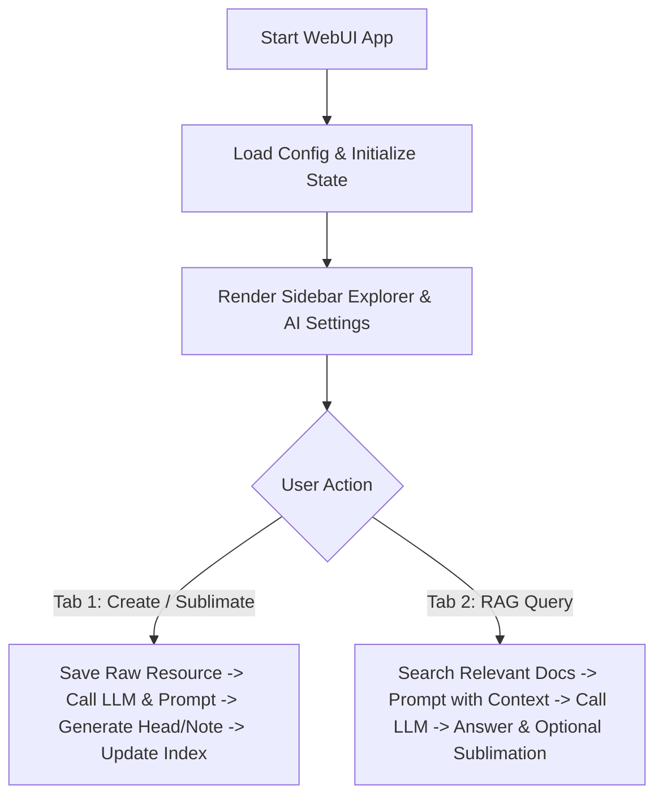

# start-webui.py 解析ノート

## 1. 概要・目的
`scripts/server/start-webui.py` は、Personal Knowledge Base（パーソナルナレッジベース）の操作・閲覧・ナレッジ昇華・RAG質問応答をインタラクティブに行うための Streamlit ベースの WebUI アプリケーションです。

起動コマンド例:
```bash
python3 -m streamlit run scripts/server/start-webui.py
```

## 2. 依存関係・インポート
- **標準ライブラリ**: `os`, `re`, `datetime`, `subprocess`
- **外部ライブラリ**: `streamlit as st`
- **プロジェクト内モジュール**:
  - `config`: `PROJECT_ROOT`, `KNOWLEDGE_DIR`, `RESOURCES_DIR`, `load_config`, `get_gemini_api_key` をインポート。
  - `rag_service`: `search_relevant_knowledge`（RAG検索用）。
  - `knowledge_service`: `generate_knowledge_files`, `auto_sublimate_rag_answer`, `get_available_prompts`（ナレッジ自動生成・昇華用）。
  - `llm_client`: `call_llm`（LLM呼び出し用）。

## 3. 主要な関数・ヘルパー
- `get_knowledge_categories() -> list[str]`:
  - `02-knowledge/` 配下のディレクトリ構造をスキャンし、有効なカテゴリ一覧を取得する（`head`, `note` などのシステムディレクトリを除外）。存在しない場合は `default` を挿入。
- `get_ollama_models() -> list[str]`:
  - ローカルの `ollama list` コマンドを実行し、利用可能なOllamaモデルの一覧を動的に取得する（embedモデルは除外）。失敗時はデフォルトモデルを返す。
- `render_explorer_tree(dir_path: str, is_knowledge: bool = False, parent_container=st.sidebar)`:
  - サイドバー上で再帰的にディレクトリと Markdown ファイルをエクスプローラー風に描画する。ファイル選択時にフォームへ読み込むハンドラを設定。
- `load_file_to_form(rel_file_path: str, is_knowledge: bool)`:
  - 選択されたファイルを読み込み、フロントマータンと本文を解析した上で Streamlit の Session State（フォーム）へ反映する。

## 4. 画面構成とUIフロー
アプリケーションは2つのメインタブ（`st.tabs`）とサイドバーで構成されています。

### サイドバー (Sidebar)
1. **⚙️ AIモデル設定**:
   - プロバイダ選択（`Ollama (Local LLM)` / `Gemini (Cloud API)`）
   - モデル選択（動的取得または設定ファイルベース）、APIキー・エンドポイント設定。
2. **📂 ファイルエクスプローラー**:
   - 新規作成ボタン（フォームリセット）
   - `02-knowledge/` のツリー表示とファイル読み込み。
   - `04-resources/` のツリー表示とファイル読み込み。

### Tab 1: 📥 状況・データ入力・編集
- **処理モード**:
  1. 一次素材の保存（`04-resources/` 配下への生データ保存）
  2. ナレッジの新規登録・AI自動昇華（`04-resources/` 保存 ➔ 指示書・LLMによる解析 ➔ `02-knowledge/` への `head/` & `note/` 生成 ➔ インデックス更新）
- 既存ファイル選択時は編集・再昇華モードとして機能。

### Tab 2: 💬 ナレッジ検索・質問 (RAG)
- ユーザーからの質問（Query）を受け付け、指定カテゴリのナレッジDBからベクトル検索（`search_relevant_knowledge`）を実行。
- 関連ナレッジの類似度とコンテキストを表示。
- LLM (`call_llm`) を用いてコンテキストを付与した正確な回答を生成。
- 生成された回答を、AIによる自動タイトル・カテゴリ判定および関連ノート抽出を経て新規ナレッジとして再昇華・保存する機能を提供。

## 5. 処理フロー図

